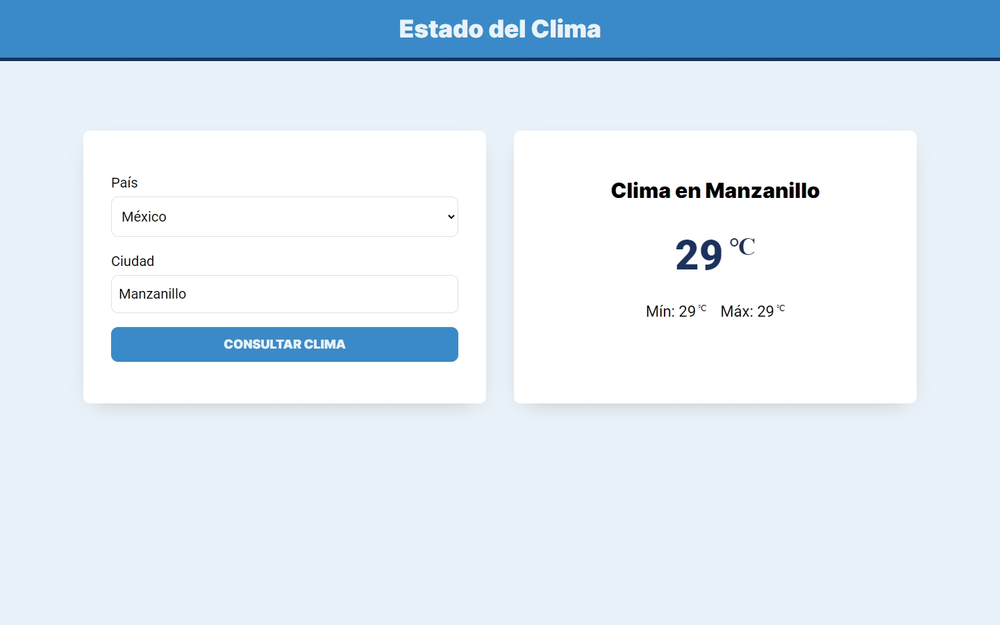

# Weather app | React - Vanilla CSS - API - Context API - Vite

## Description
- Development with React.
- Context API for state management.
- API [Open Weather Map](https://openweathermap.org/api).

## Preview
| **Home** |
| :-------------: |
|  |

## Installation

To install and run the project locally, follow these steps:

1. To clone and run this application, you'll need [Git](https://git-scm.com/) and [Node.js](https://nodejs.org/es) (which comes with npm) installed on your computer.
2. Clone the repository: `git clone https://github.com/victorivanlopezlearning/insurance-quote-react.git`
3. Navigate to the project directory: `cd insurance-quote-react`
4. Install the dependencies: `npm install`
6. Remove .template from .env.template file.
7. In the environment variable `VITE_API_KEY` of the .env file. Get the key at [openweathermap.org/api](https://home.openweathermap.org/api_keys)
5. Start development server from Vite: `npm run dev`
6. Open your browser and visit the URL provided by development server. See the application in action.

## Built with

- JavaScript Library - [React V18](https://es.react.dev/)
- Mobile-first workflow
- API - [Open Weather Map](https://openweathermap.org/api)
- HTTP Client - [Axios V1.4](https://axios-http.com/docs/intro)
- Spinner - [SpinKit](https://tobiasahlin.com/spinkit/)
- Build Tool - [Vite V4](https://vitejs.dev)